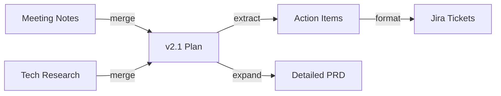

**English** | [中文](DESIGN.zh-CN.md)

# Design Document

## Problem Statement

When using AI for writing and knowledge management, documents are no longer "write once, final draft" — they are living documents that evolve through multiple rounds of conversation. Current pain points:

1. **Not traceable**: What changed in a conversation, why, based on what context? No way to verify after the fact
2. **Not reproducible**: The same "extract" operation with a different model/prompt yields completely different results, but nothing is recorded
3. **Not reusable**: Good transformation prompts are scattered across chat histories, impossible to templatize
4. **Not measurable**: How good is the AI output? How much was adopted? No data

Markdown Graph aims to provide **a versioned, traceable, and measurable graph structure for AI-assisted document engineering**.

---

## Entry Points

The project can be used at multiple levels, from zero-barrier to deep integration:

### Level 1: Manual (JSON + Markdown)

The most basic usage, zero dependencies. Users manually edit `.graph.json` files to record each conversation.

```
User edits graph.json → git commit → accumulate graph data
```

**Use case**: Personal knowledge management, small team documentation

### Level 2: VS Code Extension (Automated Recording)

The core entry point. The extension automatically captures after a Copilot conversation:
- Which documents were referenced (source nodes)
- Which documents were generated/modified (target nodes)
- Model, agent, and skills used
- User provides transform type and brief description

```
Copilot conversation → Extension popup/sidebar → Confirm edge → Auto-append to graph.json
```

### Level 3: Agent / Skill Integration

As VS Code Agent Mode `.instructions.md` or `SKILL.md`:

- **agent.md**: Define a dedicated "document engineering" agent mode that automatically organizes conversations into edges
- **SKILL.md**: As a skill invoked by other agents, providing `record_edge()` capability

```yaml
# .github/copilot-instructions.md snippet
After each conversation round, invoke the markdown-graph skill to record the transformation as an edge.
```

### Level 4: CLI Tool

Command-line batch processing:

```bash
mg init                        # Initialize graph
mg add-edge --type merge \
  --source doc-a.md doc-b.md \
  --target merged.md           # Manually add edge
mg validate                    # Validate graph consistency
mg visualize                   # Generate visualization
mg stats                       # Statistical analysis
```

---

## Core Features

### 1. Edge Recording

**Core capability**: Record a complete AI conversation round as a directed edge.

```jsonc
{
  "id": "e-20260405-001",
  "sources": ["n-meeting-notes", "n-tech-research"],
  "targets": ["n-v21-plan"],
  "transform": { "type": "merge", "..." : "..." },
  // New: Review records
  "review": {
    "status": "accepted",           // accepted | revised | rejected
    "revision_notes": "Adjusted priority ordering",
    "qa": [
      { "q": "Why MeiliSearch over ES?", "a": "Limited team ops capacity" },
      { "q": "Can the P2 export feature be deferred?", "a": "Yes, doesn't affect core experience" }
    ]
  }
}
```

**Review QA Records**: User review of AI output is not binary "accept/reject" — it's a conversational process. Records include:
- Adoption status (accepted as-is / revised then accepted / rejected)
- Revision notes
- QA pairs (user follow-ups + AI responses)

### 2. Edge Reusability

Good transformation patterns should be templatizable:

```jsonc
// templates/extract-meeting-actions.json
{
  "template_id": "tpl-extract-actions",
  "name": "Meeting Notes → Action Item Extraction",
  "transform": {
    "type": "extract",
    "prompt_template": "Extract all action items from meeting notes, group by owner, include deadlines",
    "recommended_model": "claude-opus-4",
    "tags": ["meeting", "action-items"]
  }
}
```

**Reusability metrics**:
- `usage_count`: Times used
- `adoption_rate`: Ratio of outputs adopted
- `avg_revision_rounds`: Average revision rounds (lower is better)
- `derived_from`: Which edge the template was derived from

### 3. Adoption Analytics

Was the target document from each edge actually used in practice?

```jsonc
{
  "analytics": {
    "edge_id": "e-20260405-001",
    "adoption": {
      "status": "adopted",             // adopted | partial | abandoned
      "adopted_ratio": 0.85,           // % of target content retained in final doc
      "time_to_adopt": "PT2H30M",      // Time from generation to final adoption
      "downstream_edges": ["e-002", "e-003"]  // Which subsequent edges reference this output
    },
    "quality_signals": {
      "revision_count": 1,             // How many revisions
      "user_rating": 4,                // User rating (1-5)
      "was_template_created": true     // Whether it was abstracted into a template
    }
  }
}
```

### 4. Visual Retrospection

Render the graph as interactive visualization, supporting:

- **Timeline view**: Show document evolution chronologically
- **Dependency graph**: Which documents depend on which sources
- **Heatmap**: Most reused edges, highest adoption templates
- **Diff view**: Click an edge to see source → target changes



Technology options:
- **Lightweight**: Mermaid diagrams (generated into Markdown)
- **Interactive**: D3.js / Cytoscape.js rendered web pages
- **VS Code integrated**: WebView Panel directly in the editor

---

## Data Flow Architecture

```
  Input Layer              Processing Layer           Storage Layer           Display Layer
┌──────────┐          ┌──────────────┐          ┌──────────────┐        ┌──────────┐
│ VS Code  │          │              │          │ .graph.json  │        │ Mermaid  │
│ Copilot  │─────────→│  Edge        │─────────→│              │───────→│ D3.js    │
│ Chat     │          │  Builder     │          │ docs/*.md    │        │ WebView  │
└──────────┘          │              │          │              │        └──────────┘
┌──────────┐          │              │          │ templates/   │        ┌──────────┐
│ CLI      │─────────→│              │─────────→│              │───────→│ CLI      │
│ Manual   │          └──────────────┘          └──────────────┘        │ Reports  │
└──────────┘                │                          │                └──────────┘
                            │                          │
                      ┌─────▼──────┐            ┌──────▼──────┐
                      │ Review     │            │ Analytics   │
                      │ QA Records │            │ Adoption    │
                      └────────────┘            └─────────────┘
```

---

## Directory Structure (Full)

```
markdown-graph/
├── README.md / README.zh-CN.md        # Project intro (bilingual)
├── DESIGN.md / DESIGN.zh-CN.md        # This file (bilingual)
├── schema/                             # JSON Schema
│   ├── node.schema.json
│   ├── edge.schema.json
│   ├── graph.schema.json
│   ├── review.schema.json             # Review/QA records
│   └── template.schema.json           # Edge templates
├── templates/                          # Reusable edge templates
│   └── *.template.json
├── docs/                               # Document nodes
├── graphs/                             # Graph definitions
├── examples/                           # Usage examples
├── src/                                # Source code (future)
│   ├── cli/                            # CLI tool
│   ├── vscode/                         # VS Code extension
│   └── viz/                            # Visualization
└── .vscode/
    └── markdown-graph.agent.md         # Agent Mode definition
```

---

## Implementation Roadmap

### Phase 0 — Current: Schema + Manual Recording ✅
- Data model design
- JSON Schema
- Manual graph.json editing

### Phase 1 — Edge Enhancement
- Add Review / QA records to schema
- Add Template schema
- Enrich examples (cover all transform types)

### Phase 2 — CLI Tool
- `mg init / add-edge / validate / stats`
- Graph consistency checks (referenced nodes exist, file paths valid)
- Basic statistics (edge/node count, transform type distribution)

### Phase 3 — Visualization
- Auto-generate Mermaid diagrams
- Static HTML interactive views

### Phase 4 — VS Code Extension
- Auto-popup edge recording panel after conversations
- Graph WebView visualization
- Agent mode integration

### Phase 5 — Analytics & Templates
- Adoption tracking
- Template recommendations
- Cross-project template sharing
