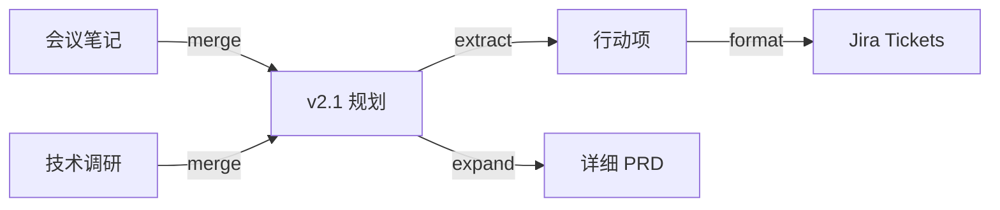

# Markdown Graph 设计文档

## 1 问题

用 AI 辅助写文档时，文档在多轮对话中持续演变。但当前工具链只记住最终结果，过程全部丢失：

- 改了什么、为什么改、基于什么上下文？——**不可追溯**
- 同样的操作换模型/prompt 结果不同，没记录——**不可复现**
- 好的转换 prompt 散落在聊天历史里——**不可复用**
- AI 输出质量如何、被采纳多少？——**不可评估**

## 2 核心模型

```
  f(prompt, x, y, z, ...) → x', y', ...

  每一轮对话就是一条有向边（transform edge），
  文档是节点（node），Prompt 也是节点，边上挂满描述信息。
```

```
┌── Prompt ──┐
│  prompt.md │─────────┐
└────────────┘         │
                       ▼
┌─── Node ───┐     ┌──Edge──┐     ┌─── Node ───┐
│  doc_a.md  │────→│        │────→│  merged.md │
│  doc_b.md  │     │ type:  │     └────────────┘
└────────────┘     │ merge  │
                   └────────┘
                   session_id: "sess-001"
                   review: { status, qa[] }
```

边不只是"连接"，是一等公民，承载完整上下文。

### 2.1 设计决策

#### DC-1：Prompt 作为文档节点

**决策**：完整 prompt 存为 Markdown 文件，作为 Node 存在于图中。

**理由**：
- Prompt 是 f() 的"函数定义"，是核心输入，应当可追溯、可复现
- Prompt 本身也会演化（v1 → v2 → v3），作为节点后可以用边记录这种演化
- 作为节点后天然支持版本管理（Git）、搜索、引用计数

**约定**：
- Prompt 文件存放在 `prompts/` 目录
- Node 的 `tags` 包含 `"prompt"`
- 保留 `transform.prompt_summary` 作为快速浏览用途（不需要打开文件就能看到摘要）

#### DC-2：`sources` 与 `prompt_nodes` 分离

**决策**：Edge 上 `sources`（输入文档）和 `prompt_nodes`（Prompt 文档）使用独立字段。

**理由**（基于撤回/重试/fork 场景分析）：
- 重试时通常只改 prompt 不改 sources，分开后一目了然哪个变了
- Fork 时通常 same sources + different prompts，分开后语义清晰
- 粘贴内容（error log 等）是 source，不是 prompt，混在一起语义模糊

```json
{
  "sources": ["n-notes"],
  "prompt_nodes": ["p-rewrite-v2"],
  "targets": ["n-summary"]
}
```

#### DC-3：Session / 撤回 / 重试支持

**决策**：Edge 新增 `session_id`、`supersedes`、`attempt` 字段。

| 字段 | 类型 | 用途 |
|------|------|------|
| `session_id` | string | 会话分组。Fork = 不同 session_id 分叉 |
| `supersedes` | string[] | 本边取代的前序边 ID（撤回/重试链） |
| `attempt` | number | 第几次尝试（可选，方便阅读） |

**场景示例**：
```
尝试1: sources=[notes] + prompt=[v1] → [out_v1]  review: rejected
尝试2: sources=[notes] + prompt=[v2] → [out_v2]  supersedes: [e1]  review: accepted
```

#### DC-4：内联内容物化为文件

**决策**：用户粘贴的长文本、error log、console output 等内联内容，物化为文件存入 `inline/` 目录。

**理由**：保持"一切皆文档"的模型一致性，内联内容作为 Node 可溯源。

**约定**：
- 文件存放在 `inline/` 目录
- Node 新增 `source_type` 字段：`file`（默认）| `paste` | `clipboard` | `stdin`
- Node 新增 `phantom` 字段：被撤回/删除的节点标记为 `true`

#### DC-5：幽灵节点（Phantom Nodes）

**决策**：被撤回的边的 target 节点标记为 `phantom: true`，而非从图中删除。

**理由**：
- 保留完整的尝试历史
- `mg validate` 区分对待：phantom 节点 + 被 supersede 的边 → 正常；正常节点 + 文件缺失 → 报错

## 3 项目入口

分 4 个层级，从零门槛到深度集成：

| 层级 | 入口 | 说明 |
|------|------|------|
| L0 | 手动编辑 `graph.json` | 零依赖，纯 JSON + Markdown，git 管理 |
| L1 | CLI 工具 `mg` | `mg add-edge`, `mg validate`, `mg stats` |
| L2 | VS Code 扩展 | 对话结束后自动弹出记录面板，自动填充 source/target |
| L3 | Agent / Skill | `.agent.md` 定义文档工程 agent，`SKILL.md` 提供 `record_edge()` 能力 |

### L0：手动（当前阶段）

```
用户写文档 → AI 对话 → 手动编辑 graph.json 记录这条边 → git commit
```

### L1：CLI

```bash
mg init                                     # 初始化
mg add-edge -t merge -s a.md b.md -o c.md   # 添加边
mg validate                                 # 校验引用一致性
mg viz                                      # 输出 mermaid 图
mg stats                                    # 边/节点/类型分布
```

### L2：VS Code 扩展

```
Copilot 对话结束
  → 扩展检测到文件变更
  → 侧栏弹出 Edge 记录面板（预填 source/target/model）
  → 用户选 transform type、写摘要
  → 自动追加到 graph.json
```

### L3：Agent / Skill

```yaml
# .vscode/markdown-graph.agent.md
你是文档工程 agent。每完成一轮文档转换后：
1. 识别本轮的输入文档和输出文档
2. 判断 transform type
3. 调用 record_edge skill 记录

# SKILL.md
提供 record_edge(sources, targets, transform) 工具
```

## 4 核心功能

### 4.0 命令入口（Slash Commands）

所有功能通过统一的斜杠命令暴露，同时适用于 VS Code Chat Participant 和 CLI：

| 命令 | 功能 | 输出 |
|------|------|------|
| `/markdowngraph` | 可视化文档关系图 | Mermaid 图 / 交互式 HTML |
| `/promptgraph` | 可视化 prompt/转换链路 | 以 prompt_summary 为标签的边图，展示 prompt 演化和复用关系 |
| `/designhealth` | 文档健康度 & 可溯源性评估 | 健康度报告（覆盖率、孤立节点、断链、溯源深度） |
| `/sessionhealth` | 当前 session 上下文健康度 | 上下文膨胀度、引用文档数、token 利用率、建议拆分点 |
| `/record` | 记录一条 edge | 交互式填写 → 追加到 graph.json |
| `/templates` | 浏览/推荐边模板 | 按采用率排序的模板列表 |
| `/stats` | 统计分析 | 边/节点数、类型分布、采用率、模型对比 |

#### `/markdowngraph` — 文档关系图

```
> /markdowngraph [--scope <graph.json>] [--depth 3] [--focus <node-id>]

输出：
- 全局依赖图：所有文档的上下游关系
- 可聚焦到某个节点，展示 N 跳范围内的关联
- 着色：按 transform type 染色边，按 adoption status 染色节点
```

#### `/promptgraph` — Prompt 转换链路图

```
> /promptgraph [--template-only] [--min-usage 3]

输出：
- 以 prompt_summary 为边标签的转换图
- 高亮高复用 prompt（粗边）和低采纳 prompt（虚线）
- --template-only：只展示已模板化的边
- 用于发现 prompt 的演化路径：v1 → v2 → v3 迭代轨迹
```

#### `/designhealth` — 文档健康度评估

```
> /designhealth [--graph <graph.json>]

评估维度：
┌─────────────────┬──────────────────────────────────────┐
│ 覆盖率          │ docs/ 下多少文档被图引用？有多少孤立文件？ │
│ 溯源深度        │ 每个文档能追溯到几层 source？            │
│ 断链检测        │ 引用了不存在的节点/文件？                │
│ 新鲜度          │ 最后一条 edge 是多久前？文档是否仍在活跃演变？│
│ Review 覆盖率   │ 多少 edge 有 review 记录？               │
│ 模板化程度      │ 多少转换被抽象为模板？                   │
└─────────────────┴──────────────────────────────────────┘

输出：健康度评分（0-100）+ 各维度详情 + 改进建议
```

#### `/sessionhealth` — Session 上下文健康度

```
> /sessionhealth

评估维度：
┌─────────────────┬──────────────────────────────────────┐
│ 上下文膨胀度    │ 当前 session 引用了多少文档？总 token 量？  │
│ 引用密度        │ 实际被 transform 使用的 vs 仅作为上下文的   │
│ 主题漂移        │ session 中 edge 的 type 分布是否发散        │
│ 建议拆分点      │ 在哪里把一个长 session 拆成多个子图更合理    │
│ 冗余检测        │ 是否有重复引用的文档、重复的 transform      │
└─────────────────┴──────────────────────────────────────┘

输出：健康度评分 + 拆分建议 + 优化建议
```

### 4.1 对话录制（Edge Recording）

每轮 AI 对话 → 一条 edge：

```jsonc
{
  "id": "e-20260405-001",
  "sources": ["n-meeting", "n-research"],
  "prompt_nodes": ["p-merge-meeting"],       // Prompt 文档节点
  "targets": ["n-plan"],
  "transform": {
    "type": "merge",
    "description": "整合会议纪要和技术调研为版本规划",
    "agent": "copilot",
    "model": "claude-opus-4",
    "skills": [],
    "prompt_summary": "合并两文档，突出决策结论"
  },
  "session_id": "sess-20260405-01",          // 所属会话
  "timestamp": "2026-04-05T10:30:00Z"
}
```

**撤回/重试记录**：

```jsonc
{
  "id": "e-20260405-002",
  "sources": ["n-meeting", "n-research"],
  "prompt_nodes": ["p-merge-meeting-v2"],    // 改了 prompt
  "targets": ["n-plan-v2"],
  "transform": { "type": "merge", ... },
  "session_id": "sess-20260405-01",
  "supersedes": ["e-20260405-001"],          // 取代前一次
  "attempt": 2,
  "timestamp": "2026-04-05T10:45:00Z"
}
```

### 4.2 Review QA 记录

用户审核 AI 输出不是二元的"用/不用"，是个对话过程：

```jsonc
{
  "review": {
    "status": "revised",              // accepted | revised | rejected
    "revision_notes": "调整了优先级排序，删除了不准确的成本估算",
    "qa": [
      {
        "q": "为什么推荐 MeiliSearch 而不是 ES？",
        "a": "团队规模小，ES 运维成本过高"
      },
      {
        "q": "P2 的导出功能可以砍掉吗？",
        "a": "可以延后，但不建议完全删除"
      }
    ],
    "final_action": "revised_and_accepted"
  }
}
```

记这些有什么用？

- 相同 prompt 反复被 revise → 说明 prompt 需要优化
- 同类问题反复出现在 QA 里 → 可以沉淀为 context/instructions
- reject 率高的 transform type → 可能不适合当前模型

### 4.3 边模板（Edge Templates）

高频出现的转换模式抽象为模板：

```jsonc
// templates/extract-action-items.template.json
{
  "template_id": "tpl-001",
  "name": "会议纪要 → 行动项",
  "transform": {
    "type": "extract",
    "prompt_template": "从会议纪要中提取行动项，按负责人分组，标注截止日期",
    "recommended_model": "claude-opus-4"
  },
  "metrics": {
    "usage_count": 12,
    "adoption_rate": 0.83,
    "avg_revision_rounds": 0.5
  }
}
```

**模板来源**：从历史 edge 中统计相似度，自动或手动提炼。

**采用率公式**：

```
adoption_rate = accepted_count / total_usage_count
```

### 4.4 采用率评估（Adoption Analytics）

追踪每条 edge 的产出是否被实际采纳：

```jsonc
{
  "analytics": {
    "edge_id": "e-001",
    "adoption": {
      "status": "adopted",           // adopted | partial | abandoned
      "adopted_ratio": 0.85,         // target 内容被保留的比例
      "time_to_adopt": "PT2H30M",    // 生成到采纳的时间
      "downstream_edges": ["e-002"]  // 被后续哪些边引用
    },
    "quality_signals": {
      "revision_count": 1,
      "user_rating": 4,              // 1-5
      "was_template_created": true   // 是否被抽象为模板
    }
  }
}
```

有了这些数据可以回答：

- 哪个模型在"提炼"任务上采纳率最高？
- 哪些 transform type 最容易一次通过？
- 平均需要几轮修订？

### 4.5 可视化工程回溯

把图渲染出来，看到文档的演变全貌：

**视图类型**：

| 视图 | 用途 |
|------|------|
| 依赖图 | 看文档间的上下游关系（谁依赖谁） |
| 时间线 | 按时间顺序看文档演变过程 |
| 热力图 | 哪些边/模板被复用最多、采纳率最高 |
| Diff 视图 | 点击某条边，看 source → target 的内容变化 |

**技术路线**：

```
L0: Mermaid 图（CLI 自动生成，嵌入 Markdown）
L1: 静态 HTML（D3.js / Cytoscape.js）
L2: VS Code WebView Panel（编辑器内交互）
```



## 5 数据流

```
  输入                      处理                       存储                   展示
┌──────────┐          ┌──────────────┐          ┌──────────────┐       ┌──────────┐
│ Copilot  │          │              │          │ graph.json   │       │ Mermaid  │
│ 对话     │─────────→│  Edge        │─────────→│ docs/*.md    │──────→│ D3.js    │
│          │          │  Builder     │          │ templates/   │       │ WebView  │
└──────────┘          └──────────────┘          └──────────────┘       └──────────┘
                            │                          │
                      ┌─────▼──────┐            ┌──────▼──────┐
                      │ Review QA  │            │ Analytics   │
                      └────────────┘            └─────────────┘
```

## 6 目录结构（规划）

```
markdown-graph/
├── README.md / README.zh-CN.md     # 说明
├── DESIGN.md                       # 本文件
├── schema/                         # JSON Schema
│   ├── node.schema.json
│   ├── edge.schema.json
│   ├── graph.schema.json
│   ├── review.schema.json          # Review/QA
│   └── template.schema.json        # 边模板
├── templates/                      # 可复用边模板
├── prompts/                        # Prompt 文档（完整 prompt 存为 .md）
├── inline/                         # 粘贴/内联内容物化文件
├── docs/                           # 文档节点
├── graphs/                         # 图定义
├── examples/                       # 示例
├── src/                            # 源代码（后续）
│   ├── cli/                        # CLI
│   ├── vscode/                     # VS Code 扩展
│   └── viz/                        # 可视化
└── .vscode/
    └── markdown-graph.agent.md     # Agent Mode
```

## 7 实施路线

| 阶段 | 内容 | 状态 |
|------|------|------|
| P0 | Schema + 手动记录 + 示例 | ✅ |
| P1 | Review / Template / Analytics Schema | ✅ |
| P2 | CLI 工具（init / record / validate / viz / stats / prompt-graph / design-health / session-health） | ✅ |
| P3 | Mermaid 可视化 + 静态 HTML | ✅ |
| P3.1 | Prompt 作为节点 + prompt_nodes 字段 + prompts/ 目录 | 🔲 |
| P3.2 | Session / 撤回 / 重试支持（session_id / supersedes / attempt） | 🔲 |
| P3.3 | 内联内容物化（inline/ / source_type / phantom） | 🔲 |
| P4 | VS Code 扩展（自动记录面板） | 🔲 |
| P5 | Agent/Skill 集成 + 模板推荐 + 采用率追踪 | 🔲 |
