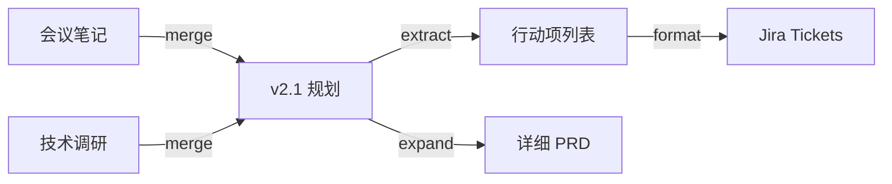

[English](DESIGN.md) | **中文**

# 设计文档

## 问题定义

当我们用 AI 辅助写作/知识管理时，文档不再是"写完即终稿"，而是在多轮对话中不断演变的活文档。当前痛点：

1. **不可追溯**：一轮对话改了什么、为什么改、基于什么上下文？事后无从查证
2. **不可复现**：同样的"提炼"操作，换个模型/prompt 结果完全不同，但没有记录
3. **不可复用**：好的转换 prompt 散落在聊天历史里，无法模板化
4. **不可评估**：AI 输出的质量如何？被采纳了多少？没有数据

Markdown Graph 的目标是：**为 AI 辅助文档工程提供一个版本化、可追溯、可评估的图结构**。

---

## 项目入口

项目可以在多个层面被使用，从低门槛到深度集成：

### 层级 1：纯手动（JSON + Markdown）

最基础的使用方式，零依赖。用户手动编辑 `.graph.json` 文件记录每次对话。

```
用户编辑 graph.json → git commit → 积累图数据
```

**适用场景**：个人知识管理、小团队文档协作

### 层级 2：VS Code 扩展（自动化记录）

核心入口。扩展在 Copilot 对话结束后自动捕获：
- 引用了哪些文档（source nodes）
- 生成/修改了哪些文档（target nodes）
- 使用的 model、agent、skills
- 用户提供 transform type 和简要描述

```
Copilot 对话 → 扩展弹窗/侧栏 → 确认 edge → 自动追加到 graph.json
```

### 层级 3：Agent / Skill 集成

作为 VS Code Agent Mode 的 `.instructions.md` 或 `SKILL.md`：

- **agent.md**：定义一个专门做"文档工程"的 agent mode，会话结束时自动整理对话为 edge
- **SKILL.md**：作为 skill 被其他 agent 调用，提供 `record_edge()` 能力

```yaml
# .github/copilot-instructions.md 片段
每轮对话结束后，调用 markdown-graph skill 记录本轮转换为一条 edge。
```

### 层级 4：CLI 工具

命令行批处理：

```bash
mg init                        # 初始化图
mg add-edge --type merge \
  --source doc-a.md doc-b.md \
  --target merged.md           # 手动添加 edge
mg validate                    # 校验图一致性
mg visualize                   # 生成可视化
mg stats                       # 统计分析
```

---

## 核心功能

### 1. 对话录制（Edge Recording）

**核心能力**：将一轮 AI 对话完整记录为一条有向边。

```jsonc
{
  "id": "e-20260405-001",
  "sources": ["n-meeting-notes", "n-tech-research"],
  "targets": ["n-v21-plan"],
  "transform": { "type": "merge", "..." : "..." },
  // 新增：Review 记录
  "review": {
    "status": "accepted",           // accepted | revised | rejected
    "revision_notes": "调整了优先级排序",
    "qa": [
      { "q": "为什么选择 MeiliSearch 而不是 ES？", "a": "团队运维能力有限" },
      { "q": "P2 的导出功能可以延后吗？", "a": "可以，不影响核心体验" }
    ]
  }
}
```

**Review QA 记录**：用户对 AI 输出的审核不是二元的"采纳/拒绝"，而是一个对话过程。记录：
- 采纳状态（直接采纳 / 修改后采纳 / 拒绝）
- 修改说明
- 问答对（用户追问 + AI 回答）

### 2. 边的复用性（Edge Reusability）

好的转换模式应该可以模板化：

```jsonc
// templates/extract-meeting-actions.json
{
  "template_id": "tpl-extract-actions",
  "name": "会议纪要 → 行动项提取",
  "transform": {
    "type": "extract",
    "prompt_template": "从会议纪要中提取所有行动项，按负责人分组，包含截止日期",
    "recommended_model": "claude-opus-4",
    "tags": ["meeting", "action-items"]
  }
}
```

**复用指标**：
- `usage_count`：被使用次数
- `adoption_rate`：输出被采纳的比率
- `avg_revision_rounds`：平均修订轮数（越少越好）
- `derived_from`：从哪条边衍生出的模板

### 3. 采用率评估（Adoption Analytics）

每条 edge 产生的 target 文档最终是否被实际使用？

```jsonc
{
  "analytics": {
    "edge_id": "e-20260405-001",
    "adoption": {
      "status": "adopted",             // adopted | partial | abandoned
      "adopted_ratio": 0.85,           // target 内容被最终文档保留的比例
      "time_to_adopt": "PT2H30M",      // 从生成到最终采纳的时间
      "downstream_edges": ["e-002", "e-003"]  // 这个输出被后续哪些边引用
    },
    "quality_signals": {
      "revision_count": 1,             // 被修订几次
      "user_rating": 4,                // 用户评分 (1-5)
      "was_template_created": true     // 是否被抽象为模板
    }
  }
}
```

### 4. 可视化工程回溯（Visual Retrospection）

将图渲染为可交互的可视化，支持：

- **时间线视图**：按时间顺序展示文档演变
- **依赖图视图**：哪些文档依赖于哪些源文档
- **热力图**：哪些边被复用最多、哪些模板采纳率最高
- **Diff 视图**：点击某条边，查看 source → target 的变化



技术选型：
- **轻量方案**：Mermaid 图（生成到 Markdown 中）
- **交互方案**：D3.js / Cytoscape.js 渲染的 Web 页面
- **VS Code 集成**：WebView Panel 直接在编辑器中查看

---

## 数据流架构

```
  输入层                    处理层                     存储层                  展示层
┌──────────┐          ┌──────────────┐          ┌──────────────┐        ┌──────────┐
│ VS Code  │          │              │          │ .graph.json  │        │ Mermaid  │
│ Copilot  │─────────→│  Edge        │─────────→│              │───────→│ D3.js    │
│ 对话     │          │  Builder     │          │ docs/*.md    │        │ WebView  │
└──────────┘          │              │          │              │        └──────────┘
┌──────────┐          │              │          │ templates/   │        ┌──────────┐
│ CLI 手动 │─────────→│              │─────────→│              │───────→│ CLI 报告 │
│ 录入     │          └──────────────┘          └──────────────┘        └──────────┘
└──────────┘                │                          │
                            │                          │
                      ┌─────▼──────┐            ┌──────▼──────┐
                      │ Review     │            │ Analytics   │
                      │ QA 记录    │            │ 采用率统计  │
                      └────────────┘            └─────────────┘
```

---

## 目录结构（完整版）

```
markdown-graph/
├── README.md / README.zh-CN.md        # 项目说明（双语）
├── DESIGN.md / DESIGN.zh-CN.md        # 本文件（双语）
├── schema/                             # JSON Schema
│   ├── node.schema.json
│   ├── edge.schema.json
│   ├── graph.schema.json
│   ├── review.schema.json             # Review/QA 记录
│   └── template.schema.json           # 边模板
├── templates/                          # 可复用的边模板
│   └── *.template.json
├── docs/                               # 文档节点
├── graphs/                             # 图定义
├── examples/                           # 使用示例
├── src/                                # 源代码（后续）
│   ├── cli/                            # CLI 工具
│   ├── vscode/                         # VS Code 扩展
│   └── viz/                            # 可视化
└── .vscode/
    └── markdown-graph.agent.md         # Agent Mode 定义
```

---

## 实施路线

### Phase 0 — 当前：Schema + 手动记录 ✅
- 数据模型定义
- JSON Schema
- 手动编辑 graph.json

### Phase 1 — Edge 增强
- 添加 Review / QA 记录到 schema
- 添加 Template schema
- 丰富示例（覆盖所有 transform type）

### Phase 2 — CLI 工具
- `mg init / add-edge / validate / stats`
- 图一致性校验（引用的节点是否存在、文件路径是否有效）
- 基础统计（边数、节点数、transform type 分布）

### Phase 3 — 可视化
- Mermaid 图自动生成
- 静态 HTML 交互视图

### Phase 4 — VS Code 扩展
- 对话后自动弹出 edge 记录面板
- 图的 WebView 可视化
- Agent mode 集成

### Phase 5 — 分析 & 模板
- 采用率追踪
- 模板推荐
- 跨项目模板共享
