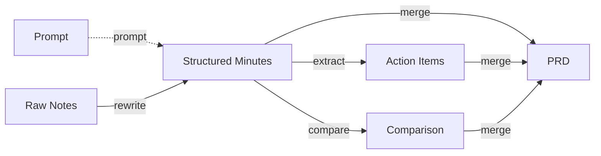

**English** | [中文](README.zh-CN.md)

# Markdown Graph

> Model AI conversations as a directed graph for traceable markdown document engineering.

## Core Idea

Each round of AI conversation is essentially a transformation function:

```
f(prompt, x, y, z, ...) → x', y', ...
```

- **Node**: A Markdown document (or document fragment) — a vertex in the graph
- **Prompt Node**: Complete prompts are also stored as document nodes — traceable and reusable
- **Directed Edge**: A conversation / transformation operation — connecting input documents to output documents
- **Edge Properties**: Full context — agent, model, skills, transform type, prompt summary, review records, session, retry chain, etc.

With this model, every document evolution becomes traceable, reproducible, branchable, and mergeable.



## Installation

```bash
cd src
npm install
npm run build
```

After building, use the CLI tool:

```bash
node dist/cli/index.js --help
```

## CLI Commands

| Command | Description | Slash Command |
|---------|-------------|---------------|
| `mg init` | Initialize project structure (docs/ graphs/ templates/ prompts/ inline/) | — |
| `mg record` | Record a transformation edge | `/record` |
| `mg validate` | Validate graph consistency (broken refs, missing files, orphans) | — |
| `mg stats` | Statistics (node/edge counts, type distribution, adoption rate) | `/stats` |
| `mg viz` | Visualize document graph (Mermaid / HTML) | `/markdowngraph` |
| `mg prompt-graph` | Prompt transformation chain graph | `/promptgraph` |
| `mg design-health` | Document health & traceability assessment | `/designhealth` |
| `mg session-health` | Session context health assessment | `/sessionhealth` |

### Usage Examples

```bash
# Initialize
mg init

# Record an edge: merge a.md and b.md into c.md
mg record -t merge -s docs/a.md docs/b.md -o docs/c.md -d "Merge meeting notes and research"

# Record with prompt file and session
mg record -t rewrite -s docs/notes.md -o docs/summary.md \
  -p prompts/rewrite.md --session sess-001

# Record a retry (supersedes previous edge)
mg record -t rewrite -s docs/notes.md -o docs/summary-v2.md \
  -p prompts/rewrite-v2.md --supersedes e-20260405-abc --attempt 2

# Validate
mg validate -g graphs/main.graph.json

# Statistics
mg stats -g graphs/main.graph.json

# Mermaid visualization
mg viz -g graphs/main.graph.json

# HTML visualization
mg viz -g graphs/main.graph.json -o html --file graph.html

# Design health assessment
mg design-health -g graphs/main.graph.json

# Session health (analyze last 5 edges)
mg session-health -g graphs/main.graph.json --last 5

# Prompt chain graph
mg prompt-graph -g graphs/main.graph.json
```

## Data Model

### Node

| Field | Type | Description |
|-------|------|-------------|
| `id` | string | Unique identifier |
| `path` | string | Relative path to the document |
| `title` | string | Document title |
| `tags` | string[] | Tags for categorization |
| `created_at` | ISO 8601 | Creation timestamp |
| `checksum` | string | Content hash for version tracking |
| `source_type` | enum | Content origin: `file`(default) / `paste` / `clipboard` / `stdin` |
| `phantom` | boolean | `true` for nodes generated by superseded/rejected edges |

### Edge

| Field | Type | Description |
|-------|------|-------------|
| `id` | string | Unique identifier |
| `sources` | string[] | Input node IDs |
| `prompt_nodes` | string[] | Prompt document node IDs (optional) |
| `targets` | string[] | Output node IDs |
| `transform` | Transform | Transformation descriptor |
| `context` | string | Additional context |
| `session_id` | string | Session identifier (optional) |
| `supersedes` | string[] | IDs of edges this one supersedes (undo/retry, optional) |
| `attempt` | number | Attempt number for retries (optional) |
| `timestamp` | ISO 8601 | Execution timestamp |
| `review` | Review | User review record (optional) |
| `analytics` | Analytics | Adoption analytics (optional) |
| `template_ref` | string | Referenced template ID (optional) |

### Transform

| Field | Type | Description |
|-------|------|-------------|
| `type` | enum | Transform type (see below) |
| `description` | string | Directional description of this conversation |
| `agent` | string | Agent used |
| `model` | string | Model used |
| `skills` | string[] | Skills / plugins invoked |
| `prompt_summary` | string | Brief summary of the prompt |

### Review

| Field | Type | Description |
|-------|------|-------------|
| `status` | enum | `accepted` / `revised` / `rejected` |
| `revision_notes` | string | Revision notes |
| `qa` | QAPair[] | Q&A pairs `[{q, a}]` |
| `final_action` | enum | Final action taken |

### Transform Types

**Text Operations**:

| Type | Description | Type | Description |
|------|-------------|------|-------------|
| `extract` | Extract / Summarize | `split` | Split |
| `expand` | Expand | `translate` | Translate |
| `create` | Create | `format` | Format |
| `rewrite` | Rewrite | `annotate` | Annotate |
| `merge` | Merge | `compress` | Compress |
| `compare` | Compare | | |

**Cognitive Operations**:

| Type | Description |
|------|-------------|
| `analyze` | Analyze (perspective analysis, SWOT, causal analysis) |
| `project` | Project (impact projection, what-if simulation, trend prediction) |
| `decide` | Decide (decision point analysis, option selection, trade-off analysis) |
| `decompose` | Decompose (generate task lists from docs, break PRD into stories) |
| `verify` | Verify (consistency check, fact-check, logic validation) |

**Composite / Custom**:

| Type | Description |
|------|-------------|
| `chain` | Chain (multi-step composite transformation) |
| `custom` | Custom |

## Project Structure

```
markdown-graph/
├── README.md / README.zh-CN.md     # Project documentation
├── DESIGN.md                       # Design document (Chinese)
├── IMPLEMENTATION.md               # Implementation plan
├── schema/                         # JSON Schema
│   ├── node.schema.json
│   ├── edge.schema.json            # Includes review/analytics/template_ref
│   ├── graph.schema.json
│   ├── review.schema.json
│   ├── template.schema.json
│   └── analytics.schema.json
├── src/                            # CLI source (TypeScript)
│   ├── core/                       # Core library
│   │   ├── types.ts                # Type definitions
│   │   ├── graph.ts                # Graph operations (CRUD, query, Mermaid)
│   │   ├── health.ts               # Health assessment
│   │   └── analytics.ts            # Statistics
│   └── cli/                        # CLI entry & commands
│       ├── index.ts
│       └── commands/               # 8 commands
├── docs/                           # Document nodes
├── prompts/                        # Prompt documents (full prompts as .md)
├── inline/                         # Materialized inline/paste content
├── graphs/                         # Graph definition files
├── templates/                      # Reusable edge templates
└── examples/
    ├── simple-merge/               # Simple merge example
    └── full-chain/                 # Full chain example (9 nodes, 5 edges)
```

## Design Philosophy

- **Docs as Code**: Manage document versions with Git, describe relationships with JSON
- **Prompts as Docs**: Prompts are first-class citizen nodes — traceable and version-controlled
- **Traceable**: Every transformation has complete context and review records
- **Undoable**: Session grouping, retry chains (supersedes), phantom nodes
- **Assessable**: Health scoring, adoption tracking, session analysis
- **Composable**: Transformations can be chained; frequent patterns become templates
- **Model-agnostic**: Not tied to any specific AI model or tool
- **Progressive**: Manual JSON → CLI → VS Code Extension → Agent/Skill

## Roadmap

- [x] Data model design & Schema definitions
- [x] CLI tool (init / record / validate / stats / viz / prompt-graph / design-health / session-health)
- [x] Review / Template / Analytics Schema
- [x] Full chain example
- [x] Prompt as document nodes + prompt_nodes field
- [x] Session / undo / retry support (session_id / supersedes / attempt)
- [x] Inline content support (source_type / phantom)
- [ ] npm publish
- [ ] VS Code extension: auto-record edges after conversations
- [ ] Interactive HTML visualization
- [ ] Edge template recommendation & adoption tracking
- [ ] Agent/Skill integration

## License

MIT
