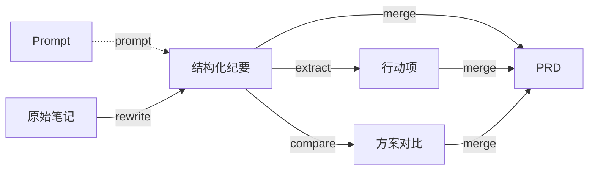

[English](README.md) | **中文**

# Markdown Graph

> 将 AI 对话建模为有向图，实现 Markdown 文档工程的可追溯管理。

## 核心思想

每一轮 AI 对话本质上是一个转换函数：

```
f(prompt, x, y, z, ...) → x', y', ...
```

- **节点 (Node)**：Markdown 文档（或文档片段），是图中的顶点
- **Prompt 节点**：完整的 Prompt 也作为文档节点存储，可追溯、可复用
- **有向边 (Edge)**：一轮对话 / 一次转换操作，连接输入文档到输出文档
- **边属性**：描述这次转换的完整上下文 —— agent、model、skills、转换类型、prompt 摘要、review 记录、session、重试链等

通过这种建模，文档的每一次演变都可被追溯、复现、分支和合并。



## 安装

```bash
cd src
npm install
npm run build
```

构建完成后即可使用 CLI 工具：

```bash
node dist/cli/index.js --help
```

## CLI 命令

| 命令 | 说明 | 对应 Slash Command |
|------|------|--------------------|
| `mg init` | 初始化项目结构（创建 docs/ graphs/ templates/ prompts/ inline/） | — |
| `mg record` | 记录一条转换边 | `/record` |
| `mg validate` | 校验图一致性（断链、缺失文件、孤立节点） | — |
| `mg stats` | 统计分析（节点/边数、类型分布、采纳率） | `/stats` |
| `mg viz` | 可视化文档关系图（Mermaid / HTML） | `/markdowngraph` |
| `mg prompt-graph` | Prompt 转换链路图 | `/promptgraph` |
| `mg design-health` | 文档健康度 & 可溯源性评估 | `/designhealth` |
| `mg session-health` | Session 上下文健康度评估 | `/sessionhealth` |

### 使用示例

```bash
# 初始化项目
mg init

# 记录一条边：将 a.md 和 b.md 合并为 c.md
mg record -t merge -s docs/a.md docs/b.md -o docs/c.md -d "合并会议纪要和调研"

# 记录边并关联 Prompt 文件
mg record -t rewrite -s docs/notes.md -o docs/summary.md \
  -p prompts/rewrite.md --session sess-001

# 记录重试（取代前一条边）
mg record -t rewrite -s docs/notes.md -o docs/summary-v2.md \
  -p prompts/rewrite-v2.md --supersedes e-20260405-abc --attempt 2

# 校验图
mg validate -g graphs/main.graph.json

# 统计
mg stats -g graphs/main.graph.json

# 生成 Mermaid 可视化
mg viz -g graphs/main.graph.json

# 生成 HTML 可视化
mg viz -g graphs/main.graph.json -o html --file graph.html

# 文档健康度评估
mg design-health -g graphs/main.graph.json

# Session 健康度（分析最近 5 条边）
mg session-health -g graphs/main.graph.json --last 5

# Prompt 链路图
mg prompt-graph -g graphs/main.graph.json
```

## 数据模型

### Node（文档节点）

| 字段 | 类型 | 说明 |
|------|------|------|
| `id` | string | 唯一标识 |
| `path` | string | 文档相对路径 |
| `title` | string | 文档标题 |
| `tags` | string[] | 标签 |
| `created_at` | ISO 8601 | 创建时间 |
| `checksum` | string | 内容哈希，用于版本追踪 |
| `source_type` | enum | 内容来源：`file`(默认) / `paste` / `clipboard` / `stdin` |
| `phantom` | boolean | 被撤回的边生成的节点标记为 `true` |

### Edge（转换边）

| 字段 | 类型 | 说明 |
|------|------|------|
| `id` | string | 唯一标识 |
| `sources` | string[] | 输入节点 ID 列表 |
| `prompt_nodes` | string[] | Prompt 文档节点 ID 列表（可选） |
| `targets` | string[] | 输出节点 ID 列表 |
| `transform` | Transform | 转换描述 |
| `context` | string | 额外上下文 |
| `session_id` | string | 所属会话 ID（可选） |
| `supersedes` | string[] | 取代的前序边 ID（撤回/重试，可选） |
| `attempt` | number | 第几次尝试（可选） |
| `timestamp` | ISO 8601 | 执行时间 |
| `review` | Review | 用户审核记录（可选） |
| `analytics` | Analytics | 采用率数据（可选） |
| `template_ref` | string | 引用的模板 ID（可选） |

### Transform（转换描述）

| 字段 | 类型 | 说明 |
|------|------|------|
| `type` | enum | 转换类型（见下方） |
| `description` | string | 本轮对话的方向性描述 |
| `agent` | string | 使用的 agent |
| `model` | string | 使用的模型 |
| `skills` | string[] | 使用的 skills |
| `prompt_summary` | string | prompt 摘要 |

### Review（审核记录）

| 字段 | 类型 | 说明 |
|------|------|------|
| `status` | enum | `accepted` / `revised` / `rejected` |
| `revision_notes` | string | 修改说明 |
| `qa` | QAPair[] | 问答对 `[{q, a}]` |
| `final_action` | enum | 最终动作 |

### 转换类型

**文本操作**：

| 类型 | 说明 | 类型 | 说明 |
|------|------|------|------|
| `extract` | 提炼 / 摘要 | `split` | 拆分 |
| `expand` | 扩写 | `translate` | 翻译 |
| `create` | 新建 | `format` | 格式化 |
| `rewrite` | 改写 | `annotate` | 标注 |
| `merge` | 整合 | `compress` | 压缩 |
| `compare` | 对比 | | |

**认知操作**：

| 类型 | 说明 |
|------|------|
| `analyze` | 分析（视角分析、SWOT、因果分析等） |
| `project` | 推演（影响推演、what-if 模拟、趋势预测） |
| `decide` | 决策（决策点推演、方案选型、trade-off 分析） |
| `decompose` | 分解（从文档生成任务列表、从 PRD 拆 story） |
| `verify` | 验证（一致性检查、fact-check、逻辑校验） |

**复合 / 自定义**：

| 类型 | 说明 |
|------|------|
| `chain` | 链式（多步骤复合转换） |
| `custom` | 自定义 |

## 项目结构

```
markdown-graph/
├── README.md / README.zh-CN.md     # 项目说明
├── DESIGN.md                       # 设计文档
├── IMPLEMENTATION.md               # 实施计划
├── schema/                         # JSON Schema
│   ├── node.schema.json
│   ├── edge.schema.json            # 含 review/analytics/template_ref
│   ├── graph.schema.json
│   ├── review.schema.json
│   ├── template.schema.json
│   └── analytics.schema.json
├── src/                            # CLI 源代码 (TypeScript)
│   ├── core/                       # 核心库
│   │   ├── types.ts                # 类型定义
│   │   ├── graph.ts                # 图操作（CRUD、查询、Mermaid）
│   │   ├── health.ts               # 健康度评估
│   │   └── analytics.ts            # 统计分析
│   └── cli/                        # CLI 入口 & 命令
│       ├── index.ts
│       └── commands/               # 8 个命令
├── docs/                           # 文档节点
├── prompts/                        # Prompt 文档（完整 prompt 存为 .md）
├── inline/                         # 粘贴/内联内容物化文件
├── graphs/                         # 图定义文件
├── templates/                      # 可复用边模板
└── examples/
    ├── simple-merge/               # 简单合并示例
    └── full-chain/                 # 完整链路示例（5 文档 4 条边）
```

## 设计理念

- **文档即代码**：用 Git 管理文档版本，用 JSON 描述文档间关系
- **Prompt 即文档**：Prompt 作为一等公民节点存储，可追溯、可版本管理
- **可追溯**：每次转换都有完整的上下文记录和 review 记录
- **可撤回**：支持 session 分组、重试链（supersedes）、幽灵节点
- **可评估**：健康度评分、采用率追踪、session 分析
- **可组合**：转换可以链式组合，高频模式可抽象为模板
- **模型无关**：不绑定特定 AI 模型或工具
- **渐进式**：手动 JSON → CLI → VS Code 扩展 → Agent/Skill

## Roadmap

- [x] 数据模型设计 & Schema 定义
- [x] CLI 工具（init / record / validate / stats / viz / prompt-graph / design-health / session-health）
- [x] Review / Template / Analytics Schema
- [x] 完整链路示例
- [x] Prompt 作为文档节点 + prompt_nodes 字段
- [x] Session / 撤回 / 重试支持（session_id / supersedes / attempt）
- [x] 内联内容支持（source_type / phantom）
- [ ] npm 发布
- [ ] VS Code 扩展：对话后自动记录 edge
- [ ] 图的交互式 HTML 可视化
- [ ] 边模板推荐 & 采用率追踪
- [ ] Agent/Skill 集成

## License

MIT

MIT
